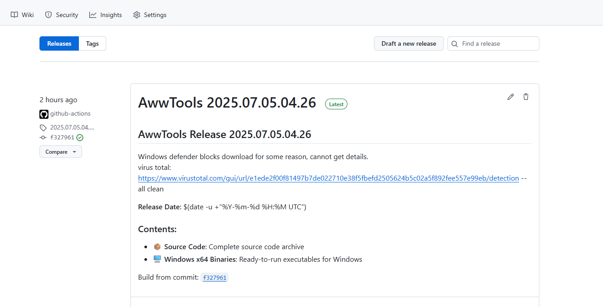
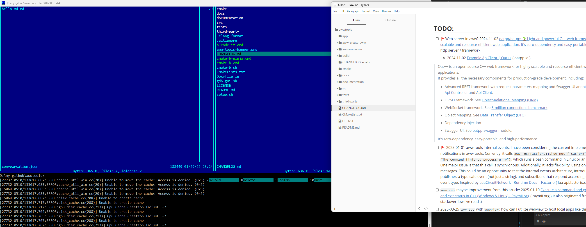
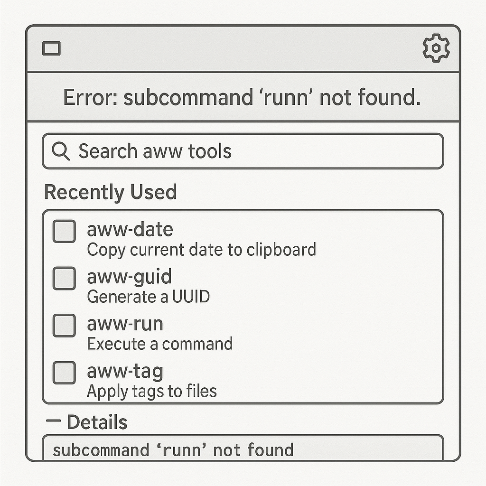
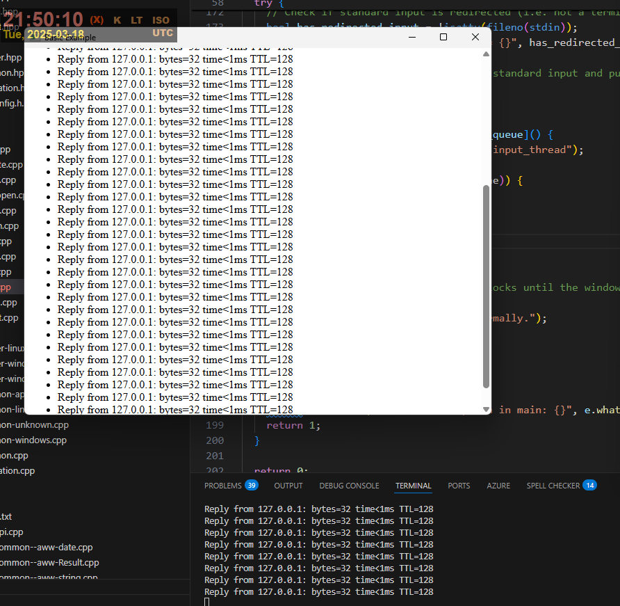

## TODO:

- [ ] 🚩Web server in aww? 2024-11-02 [oatpp/oatpp: 🌱Light and powerful C++ web framework for highly scalable and resource-efficient web application. It's zero-dependency and easy-portable.](https://github.com/oatpp/oatpp) { github.com } http server / framework
  - 2024-11-02 [Example ApiClient | Oat++](https://oatpp.io/examples/api-client/) { oatpp.io }

> Oat++ is an open-source C++ web framework for highly scalable and resource-efficient web applications.
> It provides all the necessary components for production-grade development, including:
>
> - Advanced REST framework with request parameters mapping and Swagger-UI annotations. See [Api Controller](https://oatpp.io/docs/components/api-controller/) and [Api Client](https://oatpp.io/docs/components/api-client/).
> - ORM Framework. See [Object-Relational Mapping (ORM)](https://oatpp.io/docs/components/orm/)
> - WebSocket framework. See [5-million connections benchmark](https://oatpp.io/benchmark/websocket/5-million/).
> - Object Mapping. See [Data Transfer Object (DTO)](https://oatpp.io/docs/components/dto/).
> - Dependency Injection
> - Swagger-UI. See [oatpp-swagger](https://oatpp.io/docs/modules/oatpp-swagger/) module.
>
> It's zero-dependency, easy-portable, and high-performance

- [ ] 🚩 2025-01-01 aww tools internal events: I have been considering the current implementation of notifications in aww tools. Currently, it calls `aww::os::actions::show_notification("aww run", "The command finished successfully")`, which runs a bash command in Linux or an API in Windows. One major issue is that this call is synchronous. Additionally, it lacks flexibility, using only one sink: OS messages. This could be an opportunity to test the internal events architecture, introducing a publisher, a type-safe event (not just a string), and subscribers that respond according to the raised event type. Inspired by [LuaCircuitNetwork - Runtime Docs | Factorio](https://lua-api.factorio.com/latest/classes/LuaCircuitNetwork.html) { lua-api.factorio.com }

- [ ] `aww run` maybe improvement from this article: 2025-01-10 [Execute a command and get both output and exit status in C++ (Windows & Linux) - Raymii.org](https://raymii.org/s/articles/Execute_a_command_and_get_both_output_and_exit_code.html) { raymii.org } it also originated from same stackoverflow I've read ;)

- [ ] 2025-03-25 `aww toy` with `webview`: how can I utilize webview to host local apps like this? https://toys.awwtools.com/ - how can I write scripts with cmd, powershell and lua which can create some default UI? should I call it `aww app` ? or `aww ui`?

# aww-tools changelog


## 2025-08-05 🚩 TODO aww text

```
aww text ! to_lower !  to_snake_case ! Any text here
Output:
any_text_here

use ! instead of pipe "|"

aww text ! to_lower !  to_snake_case ! to_clipboard ! Any text here
Output:
any_text_here
also copy to clipboard

aww text ! from_clipboard! to_lower !  to_snake_case ! to_clipboard !
transforms text from clipboard and copies it back

```

Should use UTF8 library.

Ideas:

- c_escape: escapes the text as c string literal `hello "world" => "hello \"world\"`
- to_snake_case: replace spaces or word boundaries with underscores and lowercase all letters
- from_snake_case: replace underscores with spaces and apply normal casing
- to_screaming_snake_case: convert to UPPERCASE_WITH_UNDERSCORES
- to_kebab_case: replace spaces or word boundaries with hyphens and lowercase letters
- from_kebab_case: replace hyphens with spaces and apply normal casing
- to_camel_case: lowercase first word, capitalize subsequent words, remove separators
- to_pascal_case: capitalize every word, remove separators
- from_camel_or_pascal_case: insert spaces before capital letters, preserve acronym groups
- to_train_case: Capitalize each word and join with hyphens
- to_title_case: capitalize the first letter of every significant word
- to_sentence_case: capitalize only the first letter of the first word of the sentence
- to_lower: convert entire string to lowercase
- to_upper: convert entire string to uppercase
- capitalize_first: uppercase only the first character
- swap_case: invert the case of every letter
- to_constant_case: convert to UPPERCASE_WITH_UNDERSCORES and collapse multiple separators
- transliterate_ascii: replace non-ASCII characters with closest ASCII equivalents
- slugify: create URL-safe lowercase string with hyphens and ASCII letters only
- remove_punctuation: strip all punctuation characters
- strip_non_alphanum: keep letters and digits only
- normalize_whitespace: collapse consecutive whitespace into single space
- strip_whitespace: trim leading and trailing whitespace
- tab_to_spaces: replace tab characters with configurable number of spaces
- spaces_to_tab: replace groups of spaces with tabs
- normalize_line_endings: convert CRLF, CR, LF variations to chosen style
- encode_html_entities: replace &, <, >, ", ' with HTML entities
- decode_html_entities: reverse html entity encoding
- escape_json_string: add backslashes to JSON-sensitive characters
- unescape_json_string: remove JSON escape sequences
- escape_regex: backslash-escape regex meta-characters
- unescape_regex: remove regex escapes where safe
- base64_encode: convert binary or text to Base64 string
- base64_decode: decode Base64 to original bytes or text
- url_encode: percent-encode unsafe URL characters
- url_decode: decode percent-encoded sequences
- rot13: apply Caesar cipher rotation by 13 places
- hex_encode: convert bytes to hexadecimal representation
- hex_decode: convert hexadecimal string back to bytes
- unicode_normalize: apply NFC, NFD, NFKC, or NFKD normalization forms
- remove_accents: strip diacritical marks without changing letters
- pluralize: convert singular English nouns to plural form
- singularize: convert plural English nouns to singular form
- number_to_words: spell out integers in English words
- words_to_number: parse spelled-out numbers into integers
- strip_comments: remove line and block comments given language grammar
- minify_json: remove whitespace and newlines in JSON text
- pretty_print_json: format JSON with indentation and sorted keys
- strip_markdown: convert Markdown to plain text
- markdown_to_html: render Markdown to HTML string
- html_to_markdown: convert HTML to Markdown approximation


## 2025-07-16 Small fixes in aww date

aww date now uses `"aww-special-string/aww-special-string.hpp"`

`aww::safe_filename_from_string`

which brings several fixes:

- multiple incorrect characters are now folder into one, so `file///::name` now file-name
- remove trailing spaces


## 🚩 2025-07-15 unit tests and mocks :(

`tests\test-aww-create.cpp`: I dislike these test cases and the mocked interfaces.

```cpp
SUBCASE("Create file in existing directory") {
    // ARRANGE
    ioDependencies.fs_exists_stub =
        [&](int callCount, const std::filesystem::path& target) -> bool { return false; };

    ioDependencies.fs_create_empty_file_stub =
        [&](int callCount, const std::filesystem::path& path) -> aww::Result {
        return aww::Result::ok();
    };

    // ACT
    aww::Result result = try_create_file_by_path(filePath, ioDependencies);

    // ASSERT
    CHECK_MESSAGE(result.is_ok(), "Result should be successful");
}
```

The test does not reveal what behavior it verifies. I stub `fs_exists` and then call `try_create_file_by_path`, but the link between them is never made explicit. It feels like a film that begins in the middle: a fact appears, the action unfolds, and the credits roll, leaving me asking why `fs_exists_stub` mattered to `try_create_file_by_path` at all.

should I really mock `fs` calls? 


## 2025-07-04

Added binary releases for Windows, because compiling on windows is very challenging. 




## 2025-07-04 Remove WebView and att-tee

`removed` :: `webview`, `aww-tee`

After several integration attempts, I’ve decided to remove the `webview` dependency and the command `aww-tee` , which was heavily reliant on it.

**Why**?

The primary reason is security and control. I realized that communicating between C++ and the WebView using `webview.eval()` and `.bind()`is fundamentally unreliable. The design became increasingly fragile as I attempted to pass messages into the WebView and back out into the C++ application.

I considered setting up an HTTP server for bidirectional communication between C++ and WebView, but that turned out to be too complex — and more importantly — potentially dangerous. This setup would allow JavaScript running inside WebView to invoke C++ functions, which, given that WebView can load arbitrary external websites, could be exploited maliciously. I didn’t want to risk any untrusted input (e.g. URLs, injected JS, etc.) eventually bridging into my native code.

Fortunately, technical issues made the communication brittle enough that this pathway didn’t mature into a stable interface — otherwise I might’ve ended up with a subtle security hole.

**Thoughts**

This was not a failure, but a lesson. I’ve tried integrating `webview/webview`into this project a few times now, and while I still think it’s an incredible project — and fun to work with when it’s the right fit — it just doesn’t belong here *right now*. I’m going to keep it on my radar for the future, but I’m hitting pause on this track.

Next steps might involve experimenting with `wxWidgets`, building my own minimal Windows UI layer, or even sticking with a terminal-based UI for now.

**Summary**

- Deleted `webview` from `CMakeLists.txt` and GitHub Actions
- Removed `aww-tee` executable and source files
- Removed routing and tool logic related to `aww-tee`
- Archived the relevant code under `dead_code/` for future reference

This was an interesting and educational experiment — I’m glad I tried it.


## 2025-06-28 Doc -- add task scoped command wrappers doc -- awwscript

`documentation` :: `task_scoped_command_wrappers_manual`

```
    examples.ps1
    examples.py
    examples.sh
    task_scoped_bash_command_wrappers_manual.md
    task_scoped_command_wrappers_manual_index.md
    task_scoped_powershell_command_wrappers_manual.md
    task_scoped_python_command_wrappers_manual.md

```


## 2025-05-25 add "notes.lua"

`awwtools/documentation/lua-samples/notes.lua`
Updated notes.lua to skip the first command-line argument, validate that user input exists (erroring if not), 
generate an ISO-formatted timestamp, create or prepend entries in notes.md

## 2025-05-16

added dev_setup/dev_setup.md

## 2025-05-13

- [ ] added `recommendations-01.md` with agentic review from Gemini 2.5 Pro for CMakeLists.txt with improvement suggestions
- [ ] added `recommendations-02.md` with agentic review from GPT-o4-mini for CMakeLists.txt with improvement suggestions

## 2025-05-11

- replaced old `get_user_home_dir` with new `get_user_home_folder` (aww tag #armgs22u42a)
- refactor get_aww_dot_folder; introduce `get_aww_dot_folder_aww_scripts_folder`
- added doxygen style documentation for common library

Good bye, CallTag

```cpp
// CallTag struct definition
struct call_tag_t {
  constexpr explicit call_tag_t(std::uint64_t value) : value(value) {
  }

  const std::uint64_t value;
};

// Compile-time hash function
constexpr std::uint64_t _compiletime_hash(const char* str, std::uint64_t hash = 0, size_t index = 0) {
  return str[index] ? _compiletime_hash(str, (hash * 131) + str[index], index + 1) : hash;
}

// call_tag function with compile-time length check for string literals
template <size_t N> constexpr call_tag_t call_tag(const char (&str)[N]) {
  static_assert(N > 11, "Tag string must be at least 11 characters long."); // N includes the null terminator
  return call_tag_t(_compiletime_hash(str));
}

```

Removed. Reason -- not useful, I will replace it with simpler logging statement.

## 2025-05-10

**Updated (windows) `launch_file` function**: Replaced `ShellExecuteA` with `CreateProcessA` to detach the launched application from the parent console. This prevents the child process from logging errors or warnings into the parent console.

This how it looked before when I opened md file from TUI Far Manager:



## 2025-04-24 💡 graphical launcher for aww suite

When you run the **“aww”** command with no parameters and mistype a subcommand, instead of a brief flash and immediate close, the program opens an accessible launcher window and reads aloud or displays the following in sequence:

- A clear spoken or textual announcement of the error, for example “Error: subcommand ‘runn’ not found.”
- Focus moves to a search field labeled “Search aww tools.” As you type, each keystroke is echoed back, and the list of available commands filters in real time.
- A list of all installed aww-tools is presented below the search field. Each entry is announced with its full name and a short description, for example “aww-date: copy current date to clipboard,” “aww-guid: generate a UUID,” “aww-tag: apply tags to files,” and so on.
- Recently used tools are automatically moved to the top and announced as “Recently used.”
- You navigate the list with the up and down arrow keys; each selection is read aloud. Pressing Enter runs the highlighted tool with the parameters you specify in the same window.
- Tool metadata (names, descriptions, parameters) is sourced from a JSON or Lua configuration file, ensuring new or updated tools are announced immediately without code changes.
- When a tool finishes or reports an error, its output is appended below in a scrollable pane that can be read back or copied, rather than closing the window.

**Considerations:**

- I really like Emacs implemented TUI and GUI in same package, this is so cool
  - 2025-04-25 [ArthurSonzogni/FTXUI: :computer: C++ Functional Terminal User Interface. :heart:](https://github.com/ArthurSonzogni/FTXUI) { github.com }
- I probably need to use WxWidgets here, browser integration can be problematic



🚩 **2025-05-10 Update**: This is kinda funny, how would I implement this without adding confusion?

So I don't want to put all this GUI functionality in `aww.exe` and want to keep it dead simple console app.

This means, `aww.exe` in case it did not find a valid aww tool, should launch the GUI launcher and terminate, passing the control to the child process.

How do I name this GUI launcher? `laww`? (like Love) `waaw` (windows aww) or `awww`? `aww-launch` ? I believe aww launch would be the most confusing, since I already have `aww run` and `aww open` I am considering merging 🚩 `aww run` and `aww open` together in future.

## 2025-03-29 logging refactor

added `src\aww-spdlog-configuration.hpp` and `init_default_spdlog_configuration` (aww tag #woar96msh50):

```cpp
    init_default_spdlog_configuration("aww-tee");
```

## 2025-03-28 ⚠️ aww-tee won't work that way!

WebView's eval does not work consistently. Using eval is not only unreliable but also insecure. I need to run an HTTP server and use proper web technologies while avoiding bind.

Let's go!

```
#define CPPHTTPLIB_OPENSSL_SUPPORT
#include "path/to/httplib.h"

// HTTP
httplib::Server svr;

// HTTPS
httplib::SSLServer svr;

svr.Get("/hi", [](const httplib::Request &, httplib::Response &res) {
  res.set_content("Hello World!", "text/plain");
});

svr.listen("0.0.0.0", 8080);
```

🚩 2025-03-29 [yhirose/cpp-httplib: A C++ header-only HTTP/HTTPS server and client library](https://github.com/yhirose/cpp-httplib) { github.com }

> A C++11 single-file header-only cross platform HTTP/HTTPS library.
>
> It's extremely easy to setup. Just include the **httplib.h** file in your code!

🚩 SSL support is available with `CPPHTTPLIB_OPENSSL_SUPPORT`. `libssl` and `libcrypto` should be linked.

## 2025-03-23 aww tag

Added option for espanso integration

```sh
aww tag --aww-no-side-effects
```

## 2025-03-23 aww-tee is not fixed!

I think I have some multithreading issue with aww tee. The command

```sh
tree | aww tee
```

produces nothing in the Html output. pollLogs seems not to be working.

At point... ah... I have decided to merge `include` and `src` folder... won't help to solve the aww tee issue, but I wanted to do it for a long time.

Removed many many files from `third-party` and replaced them with

```cmake
## nlohmann_json
FetchContent_Declare(
    json
    URL https://github.com/nlohmann/json/releases/download/v3.11.3/json.tar.xz
)
FetchContent_MakeAvailable(json)

## fmt
FetchContent_Declare(
  fmt
  GIT_REPOSITORY https://github.com/fmtlib/fmt.git
  GIT_TAG        10.2.1
  GIT_SHALLOW    TRUE
)
FetchContent_MakeAvailable(fmt)

## spd::log
FetchContent_Declare(
  spdlog
  GIT_REPOSITORY https://github.com/gabime/spdlog.git
  GIT_TAG        v1.13.0
  GIT_SHALLOW    TRUE
)
set(SPDLOG_BUILD_SHARED OFF CACHE BOOL "Build shared library" FORCE)
set(SPDLOG_FMT_EXTERNAL ON  CACHE BOOL "Use external fmt library instead of bundled" FORCE)
FetchContent_MakeAvailable(spdlog)
```

## 2025-03-18 aww-tee fixed

Good test command on Windows:

```sh
ping -t 127.0.0.1
```

```
ping -t 127.0.0.1 | aww tee
```

works correct in cmd. Has some issue with powershell, but it finally works!



I had to switch from pushing messages with `w.eval` to rather poll messages from javascript with `pollNewLogs`

`w.eval` does not work. The current implementation is better, because it let's browser control the log rendering in more usual way.

## 2025-03-18 webview in aww-tee

I have really stuck at this loop, don't know why eval seems not to be working, what is wrong? How do I pass data to webview?

I can call `window.notifyReady()` from debug console, but not from `eval` 🚩

```cpp
    std::thread ready_thread([&w, &webview_ready]() {
      spdlog::info("#mtshvdvxg6k check webview_ready started");
      while (!webview_ready.load(std::memory_order_acquire)) {
        try {
          // Call the bound notifyReady function.
          spdlog::info("#6cb1fx9g2p5 attempt to call window.notifyReady();");
          // w.eval("if (typeof window.notifyReady === 'function') { window.notifyReady(); }");
          // AAAAAAAAAAAAAAAAAAAAAAAAAAAA
          w.eval("window.notifyReady();");
        } catch (const std::exception& e) {
          spdlog::debug("notifyReady call error: {}", e.what());
        }
        std::this_thread::sleep_for(std::chrono::milliseconds(100));
      }
    });

```

## 2025-03-16 aww-tee

`aww-tee` is a tool designed to display logs. It outputs logs to the console and also streams them to a browser window. The idea is to use the browser for better log searching and filtering. In some cases, when another application runs a command, the output is hidden, so you can't tell if something is happening or if there's an error. `aww-tee` helps by showing this information clearly.

It's also difficult to select and copy logs from the console without disrupting the running process, especially since using Ctrl+C can interrupt things. `aww-tee` aims to make copying logs easier.

## 2025-01-19 Sun

Implemented `aww stuff cat` (cat_command) -- reads file and writes content to stdout:

mostly to test new `aww::result<T>` from awwlib (aww tag #jyjhwmmy084)

## 2025-01-10

- [ ] 🚩Huh, I am gonna need to use `std::filesystem::u8path(utf8_string);`
      for file and folder creation
      Added new doc: `./dev-doc/cross_platform_filesystem_path_handling_in_cpp20.md`

`get_command_line_arguments` aww tag #w9e1s4uq1xt from aww-os has solved this problem! in aww-stuff.

```
"save-command-line-args-to-file"
Bytes: 73 61 76 65 2d 63 6f 6d 6d 61 6e 64 2d 6c 69 6e 65 2d 61 72 67 73 2d 74 6f 2d 66 69 6c 65
"Привет"
Bytes: d0 9f d1 80 d0 b8 d0 b2 d0 b5 d1 82
"Мир!"
Bytes: d0 9c d0 b8 d1 80 21
"日本語テキスト"
Bytes: e6 97 a5 e6 9c ac e8 aa 9e e3 83 86 e3 82 ad e3 82 b9 e3 83 88
```

- [ ] 🚩 Needs some testing on Linux

---

Only one problem with encoding: the program receives already broken command line parameters

```
aww-stuff save-command-line-args-to-file Привет Мир! 日本語テキスト
```

```
"save-command-line-args-to-file"
Bytes: 73 61 76 65 2d 63 6f 6d 6d 61 6e 64 2d 6c 69 6e 65 2d 61 72 67 73 2d 74 6f 2d 66 69 6c 65
"??????"
Bytes: 3f 3f 3f 3f 3f 3f
"???!"
Bytes: 3f 3f 3f 21
"???????"
Bytes: 3f 3f 3f 3f 3f 3f 3f
```

## 2025-01-09 Thu

Added new functionality to `aww-stuff`:

- `save-clipboard-to-file`: Saves the current clipboard text to a file.
- `set-clipboard-from-file <file_name>`: Sets the clipboard text from the specified file.

The interesting research question is if I need to do anything special for handling UTF-8 text? The only issue I see right now is incorrect console output on windows, because console is not UTF-8 by default. This can be fixed by setting the console to UTF-8 mode:

```sh
chcp 65001
```

Once it is set, the console will display UTF-8 characters correctly. Even this ones:

> Привет 🌍 こんにちは


Replaced `deps.show_notification` calls with `spdlog` logging calls for better logging and error handling.

## 2025-01-08 Wed

Added new tool `aww-stuff` to simplify integration testing and experiments with external APIs.

## 2025-01-03 Fri

Oh, cool! Reduced copy pasta in aww-run.

Created new function

```cpp
std::vector<fs::path> get_script_search_locations(std::string scriptName,
                                                  const script_search_locations& searchLocations,
                                                  const script_extensions& extensions) {
```

Which considers all possible locations for script (not that many) and returns list of candidates.

Started experiment with value objects:

```cpp
struct script_search_locations {
  std::vector<fs::path> values;

  explicit script_search_locations(std::initializer_list<fs::path> paths) {
    for (const auto& path : paths) {
      values.emplace_back(path);
    }
  }
};

struct script_extensions {
  std::vector<std::string> values;

  // Constructor accepting initializer list of strings
  explicit script_extensions(std::initializer_list<std::string> extensions) {
    for (const auto& extension : extensions) {
      values.emplace_back(extension);
    }
  }
};
```

Look stylish when initialized:

```cpp
  const fs::path currentDir = fs::absolute(fs::current_path());
  const fs::path awwScriptsDir = currentDir / "aww-scripts";
  const fs::path awwDotScriptsDir = aww::os::env::get_aww_dot_dir() / "aww-scripts";
  const fs::path awwDir = currentDir / "aww";

  const script_search_locations searchLocations{currentDir, awwScriptsDir, awwDotScriptsDir,
                                                awwDir};
```

- [ ] 🚩I can move some duplicate logic higher
- [ ] 🚩 try to fix the aww term bug on ubuntu with no terminal, instead call the `/bin/env bash`
- [ ] 🚩 Why do I need aww::os::can_execute ????

## 2024-12-25 Implement lua arg in aww run

- [x] Implement Lua arg support 2024-12-26 [interactive lua: command line arguments - Stack Overflow](https://stackoverflow.com/questions/2945819/interactive-lua-command-line-arguments) {stackoverflow.com}. See **./lua-samples/argy.lua**

So, no this script works:

```lua
print("ARGUMENTS!")
for i,v in ipairs(arg) do
    print("Argument " .. i .. ": " .. v)
end
```

Implementation:

```cpp
      // Populate Lua's 'arg' table with command-line arguments
      lua_newtable(L); // Create a new table

      // add the script path as the first argument
      constexpr int LUA_TABLE_INDEX = -3; // Index of the table in the Lua stack
      lua_Number luaCmdIndex = 1;
      lua_pushnumber(L, luaCmdIndex);
      lua_pushstring(L, scriptPath.string().c_str());
      lua_settable(L, LUA_TABLE_INDEX);

      // starts from 1 because the first argument is the script path which is already added
      for (size_t i = 1; i < mutableCmdArgs.size(); ++i) {
        luaCmdIndex += 1.0;
        lua_pushnumber(L, luaCmdIndex);               // Push the index (Lua uses 1-based indexing)
        lua_pushstring(L, mutableCmdArgs[i].c_str()); // Push the argument string
        lua_settable(L, LUA_TABLE_INDEX);             // Set table[arg_index] = arg_value
      }
      lua_setglobal(L, "arg"); // Set the table as the global 'arg'

```

I have also modified the script in LUA TODO -- luatext.lua

The change is: lua scripts will use global table `arg` instead of any custom ones.

🟠 The Lua `arg[1]` will always be the full and absolute path to the current script. I was confused when I discovered that in C++, the value of `argv[0]` depends on the operating system and is generally not reliable.

## 2024-12-14 LUA TODO

- [ ] 🚩 Implement lua support for the sample file: 2024-12-14 [dot-awwtools/aww-scripts/luatext.lua](https://github.com/dzharii/dot-awwtools/blob/main/aww-scripts/luatext.lua) { github.com }

```
aww.clipboard.getClipboardText() -- returns current clipboard as a string
```

```
luatext.lua
```

```lua
--[[
============================================================
Experimental Lua Script
This script demonstrates an example implementation of a command-line interface using the (aww) LUA embedded engine.
It includes commands for displaying help and processing clipboard text.
2024-12-07
============================================================
]]

local aww = require("aww")

local function execute_command(command)
    local COMMAND_HELP = "help"
    local COMMAND_UPPERCASE_CLIPBOARD = "uppercase-clipboard"

    local HELP_MESSAGE = [[
Usage:
   luatext.lua <command>
   aww run luatext <command>

Commands:
    ]] .. COMMAND_HELP .. [[:
      Shows this help message
    ]] .. COMMAND_UPPERCASE_CLIPBOARD .. [[:
      Reads text from the clipboard, converts it to uppercase, and outputs the result

]]

    command = string.lower(command)

    if command == COMMAND_HELP then
        print(HELP_MESSAGE)
    elseif command == COMMAND_UPPERCASE_CLIPBOARD then
        local clipboard_text = aww.clipboard.getClipboardText()
        if clipboard_text and clipboard_text ~= "" then
            print(string.upper(clipboard_text))
        else
            print("Clipboard is empty or contains no text.")
        end
    else
        print("Unknown command: " .. command)
        print(HELP_MESSAGE)
        os.exit(1)
    end

    print("Done: " .. os.date("!%Y-%m-%dT%H:%M:%SZ"))
end

-- Main execution
if #args < 2 then
    print("Error: Command is required.")
    os.exit(1)
end

execute_command(args[2])

```

## 2024-11-09

Added LUA... via aww lib... via

2024-11-09 [marovira/lua: The Lua Programming Language with Modern CMake](https://github.com/marovira/lua/tree/master) { github.com }


Lua is published under the MIT license and can be viewed [here](https://github.com/marovira/lua/blob/master/LUA_LICENSE). For more information, please see their official website [here](https://www.lua.org/).

This bundle is published under the BSD-3 license can be viewed [here](https://github.com/marovira/lua/blob/master/LICENSE)

## 2024-11-07 Thu

The next steps:

Add lua as the configuration language

Add lua as aww-run executable script

Lua with CMake:

2024-11-08 [marovira/lua: The Lua Programming Language with Modern CMake](https://github.com/marovira/lua?path=) { github.com }

Download fresh Lua from official site:

[Lua: download](https://www.lua.org/download.html)

## 2024-11-07 Thu

Despite the number of changes in this pull request and the many files modified, most of this is due to the introduction of a new styling format with `clang-format`. I reformatted a lot of files, fixed some bugs (which I don't fully recall), and made a major change by working to migrate and extract library functions from `awwlib` into a separate repository also named `awwlib`.

The plan moving forward is to integrate Lua as the language for configuration and scripting, with support for `aww-run`. To proceed with these next steps, I need to merge these changes now and start with a clean slate.

## 2024-10-27 Sun

I wanted to test if I can apply "Curiously recurring template pattern (CRTP)" instead of using virtual polymorphism.

CRTP offers compile time polymorphism, which, I suppose can be faster, but it requires some hacks.

And the main hack, is that instead of this in the interface declaration:

```cpp
int aww_date_main(const std::vector<std::string>& cmdArgs,
                  aww_date_io_dependencies_interface& deps);
}
```

I would need to do this:

```cpp
int aww_date_main(const std::vector<std::string>& cmdArgs,
                  auto& deps);
}
```

which makes the interface ambiguous for the reader. I really want to declare that the tool needs `aww_date_io_dependencies_interface&`.

Read more:

- [c++ - What is the curiously recurring template pattern (CRTP)? - Stack Overflow](https://stackoverflow.com/questions/4173254/what-is-the-curiously-recurring-template-pattern-crtp) { stackoverflow.com }
- 2024-10-27 [4. Polymorphism and CRTP](https://blog.zharii.com/blog/2024/09/01/links-from-my-inbox#4-polymorphism-and-crtp) { blog.zharii.com }

Update: Oh, I found this, so the problematic `auto` code can be expressed as:

```cpp
template<typename T>
int aww_date_main(const std::vector<std::string>& cmdArgs,
                  aww_date_io_dependencies_interface<T>& deps);
}
```

I might return back to this note and reconsider CRTP

2024-10-28 📌 [The Curiously Recurring Template Pattern (CRTP) - Fluent C++](https://www.fluentcpp.com/2017/05/12/curiously-recurring-template-pattern/) { www.fluentcpp.com }

> - The CRTP, episode One: [Definition](https://www.fluentcpp.com/2017/05/12/curiously-recurring-template-pattern/)
> - The CRTP, episode Two: What the CRTP can bring to your code
> - The CRTP, episode Three: [An implementation helper for the CRTP](https://www.fluentcpp.com/2017/05/19/crtp-helper/)

Here is the converted CRTP code without fix:

```cpp
#pragma once
#ifndef AWW_DATE_HPP
#define AWW_DATE_HPP

#include <string>
#include <vector>

#include "aww-common.hpp"
#include "clip.h"

namespace aww::internal::aww_date {

template <typename Derived> class aww_date_io_dependencies_interface {
public:
  ~aww_date_io_dependencies_interface() = default;

  std::string get_date_yyyymmdd([[maybe_unused]] aww::call_tag_t tag) {
    return static_cast<const Derived*>(this)->get_date_yyyymmdd(tag);
  }

  bool clipboard_set_text(const std::string& text, [[maybe_unused]] aww::call_tag_t tag) {
    return static_cast<const Derived*>(this)->clipboard_set_text(text, tag);
  }

  void show_notification(const std::string& title, const std::string& message,
                         [[maybe_unused]] aww::call_tag_t tag) {
    static_cast<const Derived*>(this)->show_notification(title, message, tag);
  }
};

class aww_date_io_dependencies
    : public aww_date_io_dependencies_interface<aww_date_io_dependencies> {
public:
  std::string get_date_yyyymmdd([[maybe_unused]] aww::call_tag_t tag) {
    return aww::date::get_date_YYYYMMDD();
  }

  bool clipboard_set_text(const std::string& text, [[maybe_unused]] aww::call_tag_t tag) {
    return clip::set_text(text);
  }

  void show_notification(const std::string& title, const std::string& message,
                         [[maybe_unused]] aww::call_tag_t tag) {
    aww::os::actions::show_notification(title, message);
  }
};

int aww_date_main(const std::vector<std::string>& cmdArgs,
                  aww_date_io_dependencies_interface& deps);
} // namespace aww::internal::aww_date

#endif

```

**Revert!**

## 2024-10-25 Fri

clang-format 'em all!

```powershell
Get-ChildItem -Recurse -Include *.cpp, *.h, *.c, *.hpp | Where-Object { $_.FullName -notlike '*\third-party\*' } | ForEach-Object { clang-format.exe -i $_.FullName }
```

## 2024-10-21

Started lib experimental migration to [dzharii/awwlib-cpp: [aww project internal\] awwlib is cross-platform C++ utility library that provides commonly used helper functions for handling environment variables, string manipulations, and date/time conversions.](https://github.com/dzharii/awwlib-cpp)

Migrated:

## 2024-03-10

Returned webview!

Working on integration with:

2024-03-10 [libcpr/cpr: C++ Requests: Curl for People, a spiritual port of Python Requests.](https://github.com/libcpr/cpr)

With some compilation issues / dll sharing issues.

## 2024-01-27

Code cleanup:

I've removed the [webview/webview](https://github.com/webview/webview) dependency, a tiny cross-platform webview library for C/C++ using WebKit and Edge WebView2. While it's an awesome tool for building cross-platform browser GUIs, I couldn't find a suitable application for it in the awwtools project. It might be better suited for a standalone project.

## 2024-01-19

Tiny update to CXX 20. No issues so far.

## 2023-12-10

My most used and most simple aww tool `aww-date` got some experimental update.

I have found that tracking the input/output dependencies calls is tricky, since, for instance, `fs_file_exists()`

can be called multiple times in the code for different cases. In the test cases, I want to somehow recreate the complex code path, but

tracking the right calls by their call order (number of times same function was called) or by the input parameters is too brittle, how can I precisely find the call I need? at first, for a long time, my idea was to rename `fs_file_exists()` to a case specific name, like:

- if `fs_template_folder_exists()`
  - if `fs_template_file_exists()`
    - do something
  - else if `fs_template_file_with_specification_exists()`
    - do something else

but to support this case I have to:

- add these function to `aww_create_io_dependencies_interface`
- then implement in `aww_create_io_dependencies`
- then create a mock in `aww_create_io_dependencies_stub`

This simple does not scale, so I have decided to tag these calls at compile time and keep the generic name.

New code added:

`include\aww-common.hpp`

```cpp
// CallTag struct definition
struct call_tag_t {
constexpr explicit call_tag_t(unsigned long long value) : value(value) {}

const unsigned long long value;
};

// Compile-time hash function
constexpr unsigned long long _compiletime_hash(const char* str, unsigned long long hash = 0, size_t index = 0) {
return str[index] ? _compiletime_hash(str, (hash * 131) + str[index], index + 1) : hash;
}

// call_tag function with compile-time length check for string literals
template <size_t N>
constexpr call_tag_t call_tag(const char (&str)[N]) {
  static_assert(N > 11, "Tag string must be at least 11 characters long."); // N includes the null terminator
  return call_tag_t(_compiletime_hash(str));
}
```

Usage at `src\internal\aww-date.cpp`

```cpp
if (deps.clipboard_set_text(result, aww::call_tag("t7svmrrhai0"))) {
    std::cout << "Copied to clipboard: " << result << "\n";
    deps.show_notification("aww date", "The date has been copied to the clipboard", aww::call_tag("tssis4p5ta2"));
} else {
    std::cout << "Failed to copy to clipboard: " << result << "\n";
    deps.show_notification("aww date", "Failed to copy the date to the clipboard", aww::call_tag("730v5jc2d3o"));
    return 1;
}
```

## 2023-12-02

Added first dev sketch:

aww structured logging
./doc-dev-articles\2023-12-02-aww-tools-structured-logging.md

## 2023-08-20

`aww-open` refactored with io dependency and unit tests

```
aww run mdtree -FilterName ".*aww-open.*" -Output dev-experiments-unit-tests\output-aww-open.md
```

## 2023-08-12

### aww git open

My current unit-testing strategy feels overwhelming:

Dependency:

- Interface, implementation
- Test implementation, manual stubs

It requires some time and discipline, but it seems to be working.

For instance, now I can write unit-tests or experiment by replacing parts of the

tool with something new and keep the previous implementation for other tools.

The Dependency patterns gives me this flexibility.

Today, I have hopefully replaces all dependencies in `aww-git-open`

### aww guid

I have designed an new prompt to assist me with stub generation for unit-tests, here it is:

#### GPT Prompt

When I say a command !implement: followed by function signature, I want you to write the implementation for the C++ function.
Do not put any extra boilerplate code (like class definitions), just give me the implementation close to the example below.
Example, my request:

```
!implement:
virtual inline aww::Result launch_file_in_browser(const std::string &url) = 0;
```

Your response:
file `io_dependencies_interface`:

```cpp
        /**
         * Launch a file in the default browser.
         * @param url The url to launch.
         * @return Aww::Result indicating the success or failure of the operation.
         */
        virtual inline aww::Result launch_file_in_browser(const std::string &url) = 0;
```

file `io_dependencies`:

```cpp
        inline aww::Result launch_file_in_browser(const std::string &url) override
        {
          // TODO: implement me
        }
```

file `io_dependencies_stub`:

```cpp
        // always define a default stub function (do not put this comment in the resulting code)
        std::function<aww::Result(const std::string&)>
            launch_file_in_browser_stub = [this]([[maybe_unused]]const std::string &url) -> aww::Result
        {
            return aww::Result::ok();
        };
        // always define a counter (do not put this comment in the resulting code)
        int launch_file_in_browser_called = 0;

        // always call the stub function and increment the call counter (do not put this comment in the resulting code)
        aww::Result launch_file_in_browser(const std::string &url) override
        {
            launch_file_in_browser_called += 1;
            return launch_file_in_browser_stub(url);
        }
```

Also [dot-awwtools/aww-scripts/mdtree.ps1 at main · dzharii/dot-awwtools · GitHub](https://github.com/dzharii/dot-awwtools/blob/main/aww-scripts/mdtree.ps1) helps a lot for setting GPT context and asking it to generate tests.

```
aww run mdtree -FilterName ".*aww-guid.*"
```

### And the unit-testing prompt worked well

I want you to be an expert developer in Test in modern C++ language who:

- writes solid and simple-to-understand unit-test for C++ projects
- uses doctest/doctest.h library for unit-testing
- prioritizes the most important tests to cover the most important code first
- writes bug-free and elegant code.

In my next message, I will give you a task; before providing your answer with the code,
brainstorm it internally:

- find and fix possible bugs
- make code organization more elegant
- ensure the code is testable and advice how to improve testability
- ensure there are no security vulnerabilities.

Codding style:

- for unused parameters use `[[maybe_unused]]` attribute

Attempt to fix the issues from discovered in the brainstorm and only then provide the answer to my request.
Say "Ack" to acknowledge or ask me any questions that may improve your response.
And then wait for my next request with the task for you.

## 2023-06-30

- Tiny refactoring for aww-git-open. Ready for making unit-tests.

## 2023-06-22

The error handling aww::Result code for I/O operations is too verbose and complex.
I've decided to revert some code to use std::filesystem functions instead and added
global error handler.

```cpp
int main(int argc, char **argv)
{
  try
  {
    std::vector<std::string> cmdArgs(argv, argv + argc);
    cmdArgs.erase(cmdArgs.begin()); // remove first element

    aww::internal::aww_create::aww_create_io_dependencies deps;
    return aww::internal::aww_create::aww_create_main(cmdArgs, deps);
  }
  catch (std::exception &ex)
  {
    std::cerr << ex.what() << "\n";
    return 1;
  }
  catch (...)
  {
    std::cerr << "Caught unknown exception.\n";
    return 1;
  }
```

The exception situation is truly should be !! exceptional !!, so I'd rather handle I/O error in the
global handler.

## 2023-06-19

The idea about returning aw::Result from each I/O operation adds lots of ugly error handling code.

nope, maybe some global try/cath will be better.
Maybe I should whitch back to std::\* io opearions.

```
    fs::path currentDir;
    if (aww::Result res = deps.fs_get_current_directory_absolute_path(currentDir); res.is_failed())
    {
      std::cout << "Failed to get current directory"
                << res.error()
                << "\n";
      return 1;
    }

```

## 2023-06-19

aww::Result improving experiment

2023-06-20 [if statement - cppreference.com](https://en.cppreference.com/w/cpp/language/if)

```cpp
    if (aww::Result res = deps.fs_get_current_directory_absolute_path(currentDir); res.is_failed())
    {
      std::cout << "Failed to get current directory"
                << res.error()
                << "\n";
      return 1;
    }
```

## 2023-06-17

- `aww_git_open` started refactoring to extract I/O dependencies

## 2023-06-08

- Refactor / move from `aww create` to `awwlib`
  - `aww::fs::` file_or_dir_exists, create_directories,
  - Rename camel case to snake case

## 2023-06-07

- Use `aww-run-aww` for custom cmd, sh and ps1 scripts

## 2023-06-05

- The Great Unit testing refactoring
- Introduced dependency pattern for input/output dependencies.
- refactored `aww date` and `aww create` to use dependency injection and covered
  the utils with unit-tests.
- `CPP_HEADER_FILE_NAME` renamed to `CAPITALIZED_FILE_NAME`
  This is important milestone to make code more stable and perform less manual adhoc tests.

## 2023-05-01

- fixed bug in aww run when failed command was reported as failed and then successful. O_O
- wintoastlib -- removed debug output

## 2023-04-16

`aww.cpp` now provides a static definition of the tool list and passes arguments directly to the tool's `main()` function using `const std::vector<std::string> &cmdArgs`. This change eliminates the need to check for the existence of `aww-tool.exe` using the filesystem and replaces the previous flow of reading arguments, serializing them as a string, and passing them to the `system()` call. Now, arguments are passed directly to the tool's main function as shown in the example below:
Before:

```
aww tool-name => read args => serialize args back as string => find-if aww-tool exists => pass args as a string via system(...) call.
```

After:

```
aww date one two three => aww::internal::aww_date::aww_date_main(awwExecutableArgs)
```

These changes result in a more efficient and streamlined workflow for using the aww tools.

## 2023-04-10

- add more `aww create` templates for powershell cmd and sh companions

## 2023-03-27

- fixed bug in `aww create` : `CPP_HEADER_FILE_NAME` to generate valid identifiers.

the commands:

```sh
aww create .\include\internal\aww-xyz.hpp
aww create .\src\internal\aww-xyz.cpp
```

were very helpful during migration to lib.

## 2021-03-26

Migrated to library:

- `aww-create.cpp`
- `aww-git-open.cpp`
- `aww-guid.cpp`
- ... and all others

## 2023-03-24

Changelog created!
`aww create` now creates folders when the file name does not have an extension. This makes it impossible to create extension-less files, but for the sake of simplicity -- it is what it is.

`aww date` -- converted to use `main` implementation from lib.
