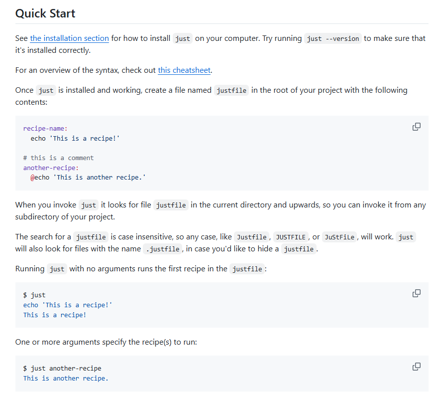

# Similar software
Date: 2024-12-07

2024-12-07✨ [casey/just: 🤖 Just a command runner](https://github.com/casey/just) { github.com } { aww run}

> AWW difference

> HN: [Just: Just a Command Runner](https://just.systems/) ([just.systems](https://news.ycombinator.com/from?site=just.systems))
>
> > I started writing my tasks in mise (https://mise.jdx.dev/tasks/) instead of just, but I found that others didn’t want to install it. Something about mise being an all-in-one tool—combining asdf/direnv/virtualenv/global npm/task management—made installing it just for the task feature off-putting. At least that's my theory. So, I’m back to using just. I am happy that there isn't a ton of pushback on adding a justfile here and there. Maybe it’s the name—‘just’ feels lightweight and is known to be fast, so people are cool with it.
>
> `just` is a handy way to save and run project-specific commands.
>
> `just` has a ton of useful features, and many improvements over `make`:
>
> - `just` is a command runner, not a build system, so it avoids much of [`make`'s complexity and idiosyncrasies](https://github.com/casey/just#what-are-the-idiosyncrasies-of-make-that-just-avoids). No need for `.PHONY` recipes!
> - Linux, MacOS, Windows, and other reasonable unices are supported with no additional dependencies. (Although if your system doesn't have an `sh`, you'll need to [choose a different shell](https://github.com/casey/just#shell).)
> - Errors are specific and informative, and syntax errors are reported along with their source context.
> - Recipes can accept [command line arguments](https://github.com/casey/just#recipe-parameters).
> - Wherever possible, errors are resolved statically. Unknown recipes and circular dependencies are reported before anything runs.
> - `just` [loads `.env` files](https://github.com/casey/just#dotenv-settings), making it easy to populate environment variables.
> - Recipes can be [listed from the command line](https://github.com/casey/just#listing-available-recipes).
> - Command line completion scripts are [available for most popular shells](https://github.com/casey/just#shell-completion-scripts).
> - Recipes can be written in [arbitrary languages](https://github.com/casey/just#shebang-recipes), like Python or NodeJS.
> - `just` can be invoked from any subdirectory, not just the directory that contains the `justfile`.
> - And [much more](https://just.systems/man/en/)!
>
> 

2024-12-07 [Installation | Task](https://taskfile.dev/installation/) { taskfile.dev }

> Task is a task runner / build tool that aims to be simpler and easier to use than, for example, [GNU Make](https://www.gnu.org/software/make/).
>
> Since it's written in [Go](https://go.dev/), Task is just a single binary and has no other dependencies, which means you don't need to mess with any complicated install setups just to use a build tool.
>
> Once [installed](https://taskfile.dev/installation), you just need to describe your build tasks using a simple [YAML](http://yaml.org/) schema in a file called `Taskfile.yml`:

2024-12-07 [j6k4m8/frof: frof runs other frofs](https://github.com/j6k4m8/frof) { github.com }

